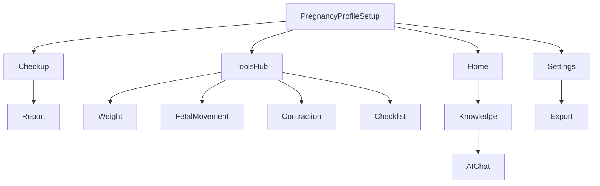

# 孕期管理小程序：任务规划、测试与 Git 策略（落地版）

> 技术栈：原生微信小程序（WXML/WXSS/JS）  
> 依据文档：`docs/孕期管理小程序产品设计文档_详细版.md`

---

## 一、里程碑与任务拆解（含验收标准）

### Milestone 0：工程与规范落地（1-2 天）

#### 0.1 工程初始化

- **任务**
  - 微信开发者工具创建项目（配置 `appid`、基础目录结构）
  - 建立目录规范
    - `miniprogram/pages/`：页面
    - `miniprogram/components/`：组件
    - `miniprogram/services/`：接口层
    - `miniprogram/utils/`：工具（日期、缓存、校验、日志）
    - `miniprogram/assets/`：静态资源
    - `miniprogram/store/`：全局状态（可选）
    - `miniprogram/tests/`：测试脚本/用例（可选）
- **验收**
  - 小程序可启动，Tab 可切换到“空壳页面”
  - 首屏无报错（控制台无红色错误）

#### 0.2 网络层与错误处理（对齐第 6/15 章）

- **任务**
  - 统一请求封装（超时、重试、统一响应结构、错误码映射）
  - 统一页面状态：`loading/empty/error/offline`
  - 幂等/防重：表单提交防抖；关键写接口支持 `clientRequestId` 或 `Idempotency-Key`
- **验收**
  - 任一接口失败能展示可理解的提示 + 重试入口
  - 断网时能显示离线条与缓存兜底（能用则用）

#### 0.3 埋点与合规底座（对齐第 13/14 章）

- **任务**
  - 埋点适配层（至少支持：事件名 + 公共字段 + 属性）
  - 权限引导组件：订阅消息、相机/相册
  - 隐私脱敏约束：禁止上报健康明细/自由文本原文
- **验收**
  - 能在本地看到关键事件触发（console 或 mock 上报均可）
  - 权限拒绝时产品路径不被阻断（能“稍后再说”）

---

### Milestone 1（P0）：核心闭环（2-4 周，建议 3 个 Sprint）

#### Sprint 1：孕期信息 + 首页（对齐 3.13 + 3.1）

- **任务清单**
  - 我的-孕期信息：状态（备孕/孕期/产后）、末次月经、预产期覆盖规则、孕前体重、身高（选填）
  - 首页（Today）：孕周卡/胎儿对比物、预产期倒计时、下次产检卡、快捷工具入口、空态引导
  - 埋点：`home_view/home_quick_tool_click/profile_edit_success` 等（对齐第 13 章）
  - 状态：未设置→空态；接口失败→错误态；离线→缓存态
- **验收标准（必须全部满足）**
  - **孕周计算正确**：设置末次月经后，展示 `第X周+Y天` 与倒计时一致（同一口径）
  - **空态清晰**：未设置孕期信息时，只出现引导，不展示无意义占位数据
  - **隐私合规**：分享卡片/埋点不包含预产期具体日期、医院名称、自由文本

#### Sprint 2：产检管理 + 报告（对齐 3.2 + 3.3）

- **任务清单**
  - 产检管理：新增/编辑/删除/标记完成、历史列表、标准时间表入口
  - 报告上传：相机/相册、多图上传、进度展示、单张失败重试
  - 报告详情：图片预览、摘要/备注编辑、AI 解读入口（可先放入口，后续接入）
  - 权限：仅点击上传时申请相机/相册；拒绝后可“仅保存产检记录”
  - 埋点：`checkup_add_submit/checkup_report_upload_success/report_view` 等
- **验收标准**
  - **图片约束正确**：格式/大小/张数限制生效，错误提示符合文档 9.2
  - **数据完整性**：产检记录与报告关联正确（按 `checkupId`）
  - **弱网可用**：上传失败可重试，且不会导致记录丢失

#### Sprint 3：工具闭环（对齐 3.6~3.9）

- **任务清单**
  - 体重：记录/编辑/删除、趋势图（先简化）、异常值二次确认
  - 胎动：session 开始/结束、+1/撤销、历史汇总
  - 宫缩：开始/结束、间隔计算、历史
  - 待产清单：模板+自定义、勾选进度、恢复默认（二次确认）、分享脱敏
  - 离线：体重/胎动/宫缩/清单支持本地暂存与联网后同步
  - 校验：对齐第 15 章（`E_FM_SESSION_RUNNING/E_CONTRACTION_TIME_INVALID/...`）
- **验收标准**
  - **离线可用**：断网也能新增记录并提示“已暂存”，联网后自动同步成功
  - **不做医疗诊断**：胎动/宫缩仅提示不判断；AI/提示均带免责声明
  - **异常兜底**：所有写操作失败都有明确提示与重试入口

---

### Milestone 2（P1）：知识 + AI + 数据导出（2-3 周）

- **知识（对齐 3.11~3.12）**
  - 列表：分类/搜索/分页、空结果提示
  - 详情：富文本、相关推荐、收藏（我的-收藏入口）
- **AI（对齐 3.10 + 14.3）**
  - 对话、快捷 chips、上下文注入开关（默认开，可关闭）
  - 安全拦截：高风险关键词优先就医建议；`E_AI_SAFETY_BLOCKED` 可回退推荐文章
- **导出（对齐 3.13.4 + 6.10）**
  - 发起导出任务、轮询状态、ready 后下载
  - 频控：`E_EXPORT_TOO_FREQUENT`
- **验收标准**
  - AI 与健康内容统一免责声明；高风险触发路径符合 14.3
  - 导出前二次确认 + 文件命名不含可识别个人信息

---

### Milestone 3（P2）：增强项（按资源择优）

- 个性化推荐、阅读进度、语音/图片提问、医院导航、多胎支持、3D 胎儿模型、报表分享/打印等

---

## 二、测试计划（提测门禁 + 用例清单）

### 2.1 提测门禁（每次提测必过）

- **冒烟必过**（见 2.2）
- **核心回归必过**：本次改动涉及页面的“主路径 + 1 个异常路径”
- **离线检查**：若改动涉及记录/同步模块，必须测断网→暂存→恢复网络→同步成功
- **权限检查**：若改动涉及相机/相册/订阅，必须测授权/拒绝两条路径
- **埋点检查**：本次涉及模块至少 3 条关键事件触发成功且脱敏

### 2.2 冒烟测试（每次提测必跑）

- 启动/首次进入（无报错）
- 设置孕期信息→首页展示正确
- 新增产检→列表出现→上传 1 张报告→报告详情可打开
- 体重新增 1 条→列表与指标更新
- 胎动：开始→+1×3→结束保存
- 宫缩：开始→结束→生成 1 条记录
- 待产清单：勾选 1 项→进度变化

### 2.3 功能用例（按模块）

#### 首页/我的（Sprint 1）

- **未设置孕期信息**：空态引导按钮可用
- **设置后展示**：孕周/倒计时一致；快捷入口跳转正确
- **分享脱敏**：分享卡片不含预产期具体日期与医院名称

#### 产检/报告（Sprint 2）

- **新增产检**：日期/类型必填校验；保存后列表出现
- **上传报告**：相机/相册权限允许；拒绝后仍可保存产检
- **上传失败重试**：单张失败可重试，成功后状态更新
- **图片校验**：格式/大小/数量越界提示符合 9.2

#### 体重/胎动/宫缩/清单（Sprint 3）

- **体重异常值**：超范围触发二次确认（`E_WEIGHT_UNREASONABLE` 对应）
- **胎动并发 session**：二次创建返回 `E_FM_SESSION_RUNNING` 并引导恢复
- **宫缩时间错误**：`endedAt < startedAt` 校验（`E_CONTRACTION_TIME_INVALID`）
- **清单长度限制**：自定义项超长返回 `E_CHECKLIST_ITEM_TOO_LONG`
- **离线暂存**：断网新增→本地可见→恢复网络同步成功

#### 知识/AI/导出（Milestone 2）

- **知识搜索空结果**：展示“清空筛选/换关键词”
- **AI 高风险关键词**：优先就医建议 + 免责声明
- **导出频控**：触发 `E_EXPORT_TOO_FREQUENT` 有明确提示

### 2.4 回归策略

- **页面级回归**：改动页面全走一遍主路径
- **依赖回归**：若改动接口层/缓存/错误码映射，则必须重跑冒烟
- **埋点回归**：每个 Sprint 末尾核验第 13.3 的 P0 事件覆盖率

---

## 三、Git 版本管理策略（从 0 开始）

### 3.1 初始化与基础文件

- 初始化仓库：`git init`
- 必备文件：
  - `.gitignore`：忽略微信开发者工具缓存/本地配置/临时导出文件
  - `README.md`：如何启动、环境要求、提测流程
- 建议提交规范：Conventional Commits（`feat/fix/docs/chore/test`）

### 3.2 分支策略（轻量可扩展）

- `main`：稳定可发布
- `develop`（可选）：集成分支（多人协作建议启用）
- `feature/<scope>`：按模块拆分（如 `feature/home`、`feature/checkup`、`feature/weight`）
- `release/<version>`：提测与修复专用（从 Milestone 2 开始建议启用）

### 3.3 提交节奏与 PR（如果你用 GitHub/Gitee）

- 每完成一个可验收小点提交一次（页面壳/列表/新增弹窗/异常兜底）
- PR 模板建议包含：
  - 变更摘要
  - 影响范围（页面/接口）
  - 测试记录（冒烟是否通过）
  - 埋点变更（新增/修改事件）

### 3.4 版本号与发布节奏

- 版本号：`MAJOR.MINOR.PATCH`
  - Sprint 结束 → `MINOR +1`
  - 线上热修复 → `PATCH +1`
- 发布前检查清单：
  - 冒烟通过
  - 本 Sprint 相关功能用例通过
  - 离线与权限路径覆盖
  - 埋点脱敏校验通过

---

## 四、推荐实施顺序（依赖最小化）

